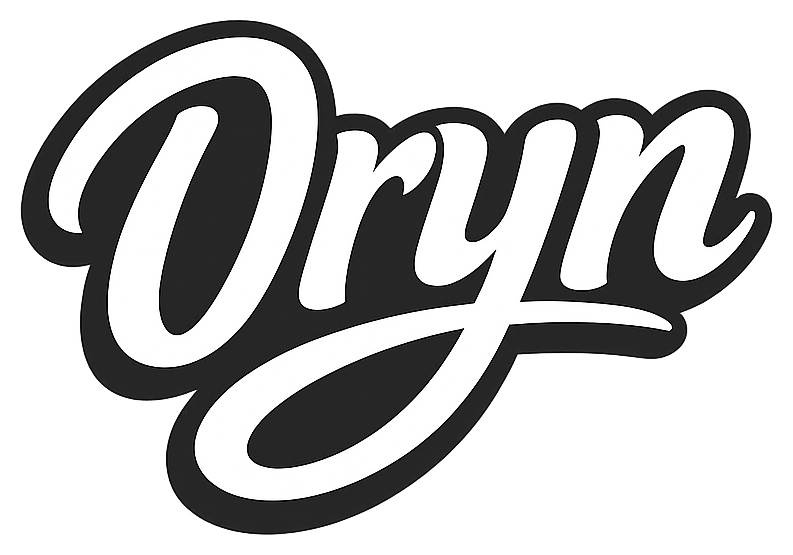
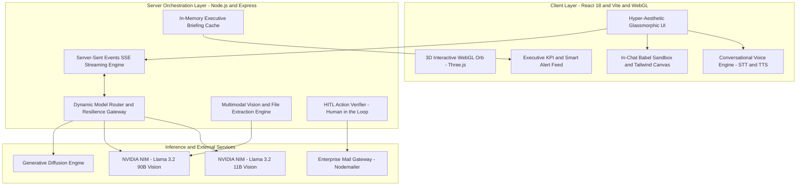
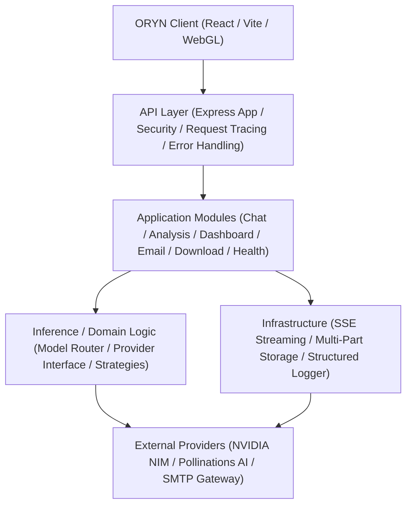

<div align="center">

<a href="https://github.com/mannietech15/Oryn" style="text-decoration: none;">
  
  &nbsp;&nbsp;
  
</a>

### **The Autonomous AI Business Manager for Modern Enterprise Platforms**

[](https://opensource.org/licenses/MIT)
[](https://www.typescriptlang.org/)
[](https://reactjs.org/)
[](https://vitejs.dev/)
[](https://nodejs.org/)
[](https://build.nvidia.com)
[](https://threejs.org/)

<p align="center">
  <b>Transform raw enterprise telemetry into proactive decisions, autonomous workflows, and interactive applications.</b>
  <br />
  Powered by NVIDIA NIM, Llama 3.2 Vision, in-browser Babel execution, and real-time WebGL spatial intelligence.
</p>

[Core Capabilities](#-core-capabilities) • [Architecture](#-system-architecture) • [Quickstart](#-quickstart-guide) • [API Reference](#-api-endpoints--event-streams) • [Tech Stack](#-technology-stack) • [Roadmap](#-roadmap)

---

</div>

## 🌌 Overview

**ORYN** is not just another conversational wrapper — it is a **next-generation agentic business co-pilot and operating system** built for executives, founders, and autonomous product teams. 

Traditional BI dashboards are static, retrospective, and passive. ORYN inverts this paradigm by combining **real-time LLM inference**, **vision-enabled multimodal document analysis**, **proactive business anomaly detection**, **live code sandbox execution**, and **human-in-the-loop email automation** into a unified, ultra-aesthetic cyberpunk workspace.

Whether diagnosing pipeline churn, compiling live React dashboards on the fly inside the conversation, or querying complex financial models across global markets, ORYN delivers enterprise-grade reasoning with lightning-fast low-latency execution.

---

## 🔮 System Architecture



> **Runtime Execution Flow:** Client telemetry and queries stream through the server's Server-Sent Events (SSE) gateway. Requests requiring code compilation are compiled in-browser via Babel Standalone, while strategic and multimodal requests are load-balanced to NVIDIA NIM inference models.

### 🏛️ Backend Domain Architecture



#### Major Module Responsibilities
- **`app`**: Express lifecycle configuration, CORS configuration, request ID tracing, centralized error interceptor, and root route registration.
- **`config`**: Environment variable validation (`env.ts`) and AI model configuration registry (`ai.config.ts`).
- **`infrastructure`**: SSE stream lifecycle management (`sse.ts`, `stream-manager.ts`), file upload storage abstractions (`upload.ts`), and structured JSON logging (`logger.ts`).
- **`modules/chat`**: Conversational orchestration, streaming SSE responses, command detection, and LLM inference invocation.
- **`modules/analysis`**: Multimodal text and image forensic extraction, document structure parsing, and executive synthesis.
- **`modules/dashboard`**: Executive KPI analytics, proactive anomaly alerts, strategic briefings, and OKR goals management.
- **`modules/email`**: Human-in-the-loop action staging and SMTP mail dispatch.
- **`modules/download`**: Secure binary asset proxy and download streaming.
- **`modules/inference`**: Decoupled AI provider interface, NVIDIA NIM provider, Pollinations fallback provider, and dynamic routing/fallback strategies.
- **`shared`**: Standardized domain exceptions (`AppError`, `ValidationError`, `ProviderError`), status codes, and input validation schemas.

---

## ⚡ Core Capabilities

| Capability | Technical Mechanism | Strategic Value |
| :--- | :--- | :--- |
| **Autonomous Telemetry & Anomaly Engine** | Structured JSON schema generation via NVIDIA NIM; automated anomaly classifier (`critical`, `warning`, `opportunity`). | Proactive threat detection, churn alerts, and OKR recommendations without manual querying. |
| **In-Browser JIT Code Sandbox** | Client-side Babel Standalone runtime transpiling React 18, Tailwind CSS, and Lucide icons into isolated preview containers. | Compiles and renders live, interactive web components on the fly inside the conversation thread. |
| **Multimodal Vision Forensics** | Llama 3.2 Vision inference pipeline processing balance sheets, invoice images, diagrams, and logs (up to 8,000 chars). | Deep structural extraction, tabular parsing, and executive-ready financial analysis in seconds. |
| **Continuous Voice Loop** | Ambient speech recognition (STT) coupled with speech synthesis (TTS) and live acoustic waveform visualizers. | Zero-latency, hands-free conversational audio loop for real-time executive briefings. |
| **Guardrailed HITL Automation** | Two-stage action verification: draft staging $\to$ explicit user confirmation $\to$ SMTP gateway dispatch. | Safe side-effect execution guaranteeing zero automated emails are sent without human sign-off. |
| **Generative Visual Studio** | Asynchronous diffusion engine via `/imagine` with seed randomized generation and binary download proxy. | Real-time generative asset creation with instant high-resolution asset downloads. |
| **Cross-Border Multi-Market Fluency** | Contextual multilingual inference supporting cross-border compliance and localized commercial nuance. | Frictionless global operations and multinational executive reporting without semantic loss. |
| **Spatial WebGL UI Architecture** | Hardware-accelerated Three.js and OGL custom shader pipelines driving dynamic 3D neural orbs and fluid physics. | Ultra-responsive 60fps dark cyberpunk canvas designed for high-density command workflows. |

---

## 🛠️ Technology Stack

| Layer | Technologies |
| :--- | :--- |
| **Frontend Framework** | [React 18.3](https://react.dev/), [TypeScript 5.4](https://www.typescriptlang.org/), [Vite 5.2](https://vitejs.dev/) |
| **Styling & Motion** | Vanilla CSS Design Tokens, [Framer Motion 12](https://www.framer.com/motion/), [Lucide React](https://lucide.dev/) |
| **3D & Visual FX** | [Three.js](https://threejs.org/), [@react-three/fiber](https://r3f.docs.pmnd.rs/), [@react-three/drei](https://github.com/pmndrs/drei), [OGL](https://github.com/oframe/ogl) |
| **Data Visualization** | [Recharts 3.9](https://recharts.org/) |
| **Backend Runtime** | [Node.js 20+](https://nodejs.org/), [Express 4.19](https://expressjs.com/), [TypeScript 5.4](https://www.typescriptlang.org/) |
| **Inference Engine** | [NVIDIA NIM](https://build.nvidia.com) (`meta/llama-3.2-11b-vision-instruct`, `meta/llama-3.2-90b-vision-instruct`) |
| **Communication & Streaming** | Server-Sent Events (SSE), [Multer](https://github.com/expressjs/multer), [Nodemailer](https://nodemailer.com/) |
| **Runtime Code Sandbox** | [Babel Standalone](https://babeljs.io/), [Tailwind CSS CDN](https://tailwindcss.com/) |

---

## 📋 System Requirements

Before running ORYN, ensure you have:

* **Node.js**: `v18.0.0` or higher (Node 20+ recommended)
* **Package Manager**: `npm` (v9+) or `pnpm`
* **NVIDIA NIM API Key**: Free trial keys available at [build.nvidia.com](https://build.nvidia.com)
* **SMTP Credentials** *(Optional)*: For live email sending (Gmail App Password, Resend, or SendGrid)

---

## 🚀 Quickstart Guide

### 1. Clone the Repository
```bash
git clone https://github.com/mannietech15/Oryn.git
cd Oryn
```

### 2. Configure Environment Variables

Navigate to the server directory and create your `.env` file:
```bash
cd ORYN-AI-SERVER
cp .env.example .env
```

Edit `.env` with your preferred credentials:
```env
PORT=3001
NODE_ENV=development
CLIENT_URL=http://localhost:5173

# NVIDIA NIM Inference API Key
NVIDIA_API_KEY=nvapi-your-key-here

# Optional: Dedicated Keys for Multi-Model Routing
NVIDIA_LOGIC_API_KEY=
NVIDIA_APEX_API_KEY=

# Optional: SMTP Configuration for Email Automation
SMTP_HOST=smtp.gmail.com
SMTP_PORT=587
SMTP_USER=your_email@gmail.com
SMTP_PASS=your_app_specific_password
```

### 3. Start the Backend Server
```bash
# In ORYN-AI-SERVER directory:
npm install
npm run dev
```
> The server will start on `http://localhost:3001` with active endpoints and SSE streaming.

### 4. Start the Client Application
Open a new terminal tab:
```bash
cd ORYN-AI-CLIENT
npm install
npm run dev
```
> Open `http://localhost:5173` in your browser to enter the ORYN interface. The client automatically connects to the server at `http://localhost:3001`.

---

## 📡 API Endpoints & Event Streams

| Method | Endpoint | Description |
| :--- | :--- | :--- |
| `GET` | `/api/health` | Healthcheck and active model status |
| `POST` | `/api/chat` | Real-time SSE streaming chat with task extraction & email dispatch |
| `POST` | `/api/analyze` | Multimodal file and vision inspection (images, documents, text) |
| `GET` | `/api/analytics` | High-level business KPIs, timeline distribution, and team metrics |
| `POST` | `/api/dashboard/command` | Natural language business analytics command processor |
| `GET` | `/api/dashboard/briefing` | Hourly cached AI executive briefing |
| `GET` | `/api/dashboard/alerts` | Proactive business threat, anomaly, and opportunity feed |
| `GET` | `/api/dashboard/goals` | OKR milestone trackers with automated recommendation endpoints |
| `GET` | `/api/dashboard/health-score` | Composite multi-factor business grade and metric breakdown |
| `POST` | `/api/send-email` | Guardrailed SMTP email dispatch endpoint |
| `GET` | `/api/download` | High-performance image proxy downloader |

---

## 📂 Project Structure

```text
ORYN-AI/
├── ORYN-AI-CLIENT/              # Frontend Web Application
│   ├── public/                  # Static assets & SVG icons
│   ├── src/
│   │   ├── api/                 # API client & fetch wrappers
│   │   ├── components/          # Reusable UI & 3D WebGL modules
│   │   │   ├── ConversationalMode.tsx  # Voice assistant mode
│   │   │   ├── DashboardScene.tsx      # Three.js 3D canvas
│   │   │   ├── Orb.tsx                 # Interactive 3D shader orb
│   │   │   ├── SplashCursor.tsx        # WebGL fluid physics cursor
│   │   │   └── Sidebar.tsx             # Collapsible session nav
│   │   ├── hooks/               # Custom hooks (useChat, useVoice)
│   │   ├── pages/               # 12 Specialized executive views
│   │   │   ├── ChatPage.tsx            # Live sandbox & chat timeline
│   │   │   ├── DashboardPage.tsx       # Command bar & health metrics
│   │   │   ├── AnalyticsPage.tsx       # Deep telemetry charts
│   │   │   ├── AutomationPage.tsx      # Workflow pipeline manager
│   │   │   └── ...
│   │   ├── types/               # TypeScript interfaces
│   │   ├── App.tsx              # Root router & layout
│   │   └── index.css            # Dark cyberpunk design system
│   └── vite.config.ts
│
├── ORYN-AI-SERVER/              # Modular Backend Inference & Business Manager
│   ├── src/
│   │   ├── config/              # Centralized environment & NVIDIA clients
│   │   ├── controllers/         # HTTP request orchestration handlers
│   │   ├── middleware/          # Multer memory storage & error handlers
│   │   ├── routes/              # Modular Express routing tables
│   │   ├── services/            # Inference, telemetry, alerts & SMTP logic
│   │   ├── types/               # Server request & schema interfaces
│   │   └── index.ts             # Clean server bootstrap & mounting
│   ├── .env.example             # Documented environment templates
│   ├── package.json             # Server dependencies
│   └── tsconfig.json
│
└── README.md                    # Project documentation
```

---

## 🔒 Security & Human-In-The-Loop Guarantees

1. **Explicit Confirmation for Side-Effects:** Emails are never dispatched without explicit user permission. The AI drafts the message, highlights recipient details, and waits for a confirming command before firing the SMTP protocol.
2. **Sandboxed Code Execution:** Dynamic code previews execute inside an isolated DOM container, safeguarding user session state.
3. **Resilient Failover Architecture:** Automatic fallback triggers ensure uninterrupted uptime if a model tier experiences rate limits (`HTTP 429`) or model deprecations.
4. **Zero Ambient Data Ingestion:** User files and analysis buffers are processed in memory with zero permanent filesystem persistence unless explicitly archived by the administrator.

---

## 🗺️ Roadmap

- [x] Llama 3.2 11B & 90B Vision Multimodal Integration
- [x] Live In-Chat Babel React / Tailwind Code Runner
- [x] Real-time Speech-to-Speech Voice Mode
- [x] Automated HITL Email Dispatch Engine
- [x] Executive Dashboard Command Bar & Anomaly Alerts
- [ ] Multi-Agent Consensus Architecture (Debate & Verification)
- [ ] Direct PostgreSQL / Supabase Database Query Connector
- [ ] Enterprise Slack & Microsoft Teams Bot Gateway
- [ ] Local Offline Model Execution via Ollama & ONNX Runtime

---

## 🤝 Contributing

Contributions are what make the open-source community an incredible place to learn, inspire, and create. Any contributions you make are **greatly appreciated**.

1. Fork the Project
2. Create your Feature Branch (`git checkout -b feature/AmazingFeature`)
3. Commit your Changes (`git commit -m 'Add some AmazingFeature'`)
4. Push to the Branch (`git push origin feature/AmazingFeature`)
5. Open a Pull Request

---

## 📄 License

Distributed under the **MIT License**. See [`LICENSE`](./LICENSE) and [`docs/LICENSING.md`](./docs/LICENSING.md) for full terms, permissions, and compliance details.

---

<div align="center">

Built with precision by **[Manasseh (MannieTech)](https://github.com/mannietech15)**

**Designed & Engineered by Manasseh** • *If you find ORYN insightful, star this repository to show support!*

</div>
