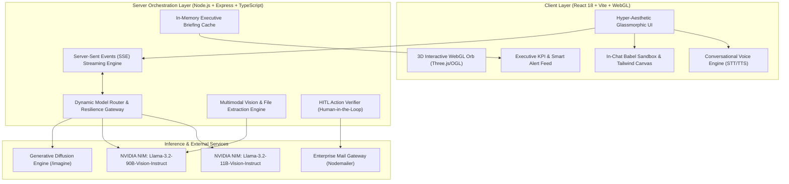

# ⚡ ORYN AI

### **Autonomous Business Intelligence & Agentic Executive Operating System**

  <b>Transform raw enterprise telemetry into proactive decisions, autonomous workflows, and interactive applications.</b>
   
  Powered by NVIDIA NIM, Llama 3.2 Vision, in-browser Babel execution, and real-time WebGL spatial intelligence.

[Explore Features](#-key-capabilities) • [Architecture](#-system-architecture) • [Quickstart](#-quickstart-guide) • [API Specs](#-api-endpoints--event-streams) • [Tech Stack](#-technology-stack) • [Roadmap](#-roadmap)

---

## 🌌 Overview

**ORYN** is not just another conversational wrapper — it is a **next-generation agentic business co-pilot and operating system** built for executives, founders, and autonomous product teams. 

Traditional BI dashboards are static, retrospective, and passive. ORYN inverts this paradigm by combining **real-time LLM inference**, **vision-enabled multimodal document analysis**, **proactive business anomaly detection**, **live code sandbox execution**, and **human-in-the-loop email automation** into a unified, ultra-aesthetic cyberpunk workspace.

Whether diagnosing pipeline churn, compiling live React dashboards on the fly inside the conversation, or querying complex financial models across global markets, ORYN delivers enterprise-grade reasoning with lightning-fast low-latency execution.

---

## 🔮 System Architecture

---

## ✨ Key Capabilities

### 1. 🧠 Proactive Executive Intelligence & Anomaly Engine
* **Natural Language Business Query Bar:** Ask questions like *"Why is customer churn spiking?"* or *"Analyze Tuesday deal velocity"* and get structured strategic JSON insights with concrete recommendations.
* **Smart Alert Feed:** Scans revenue pacing, stalled accounts, support spikes, and broken integrations with automated risk-level categorization (`critical`, `warning`, `opportunity`, `info`).
* **Dynamic OKR Tracking:** Real-time progress monitoring against Q2 revenue, growth, and task milestones with on-demand strategic advice.
* **Business Health Scoring:** Continuous multi-factor grading across revenue health, user retention, team throughput, and integration health.

### 2. 💻 Live In-Chat Code Sandbox & Dynamic React Runner
* **Instant Babel Standalone Compilation:** When ORYN generates React components, Tailwind layouts, HTML, or SVG, they compile and render directly inside an interactive sandboxed modal.
* **Full State & Interactivity:** Test functional buttons, toggles, forms, and charts without leaving the chat thread.
* **Zero Dependencies on Local Bundlers:** Renders dynamic JSX, Lucide icons, and Tailwind styles on the fly via client-side runtime injection.

### 3. 🎙️ Real-Time Conversational Voice Mode
* **Hands-Free Ambient Audio Loop:** Built-in speech recognition and vocal synthesis engine for fluid voice conversations.
* **Live Acoustic Waveform Visualizer:** Dynamic audio feedback with intuitive status indicators for listening, processing, and speaking.

### 4. 👁️ Multimodal Vision & Document Forensics
* **Powered by Llama 3.2 Vision:** Upload financial statements, product wireframes, receipts, UI screenshots, or CSV dumps up to 8,000 characters.
* **Deep Structural Extraction:** Auto-parses balance sheets, extracts tabular datasets, and surfaces actionable business summaries in seconds.

### 5. 🎨 Generative Creative Studio (`/imagine`)
* **Instant High-Fidelity Diffusion:** Trigger image creation via `/imagine <prompt>` or conversational requests like *"Generate a sleek 3D logo for a fintech brand"*.
* **Streaming Previews & Shimmer Loaders:** Real-time visual feedback with direct one-click high-resolution asset downloads through a backend proxy.

### 6. 🛡️ Human-in-the-Loop (HITL) Email Automation
* **Autonomous Drafting, Guardrailed Dispatch:** ORYN drafts context-rich transactional or cold-outreach emails, requests explicit confirmation, and dispatches only upon user approval.
* **Nodemailer SMTP Integration:** Works seamlessly with Gmail, Outlook, Amazon SES, or local development mock modes.

### 7. 🌐 Global Multilingual & Multi-Market Intelligence
* **Cross-Border Enterprise Fluency:** Native understanding across global languages with deep context retention for international market expansion, regional business compliance, and multilingual executive communications.

### 8. 🎨 Hyper-Aesthetic Neo-Dark Workspace
* **3D Neural Orb:** Built with React Three Fiber, Three.js, and OGL shaders for reactive ambient visual feedback.
* **Interactive Fluid Splash Cursor:** 60fps WebGL particle cursor trails and refined physics.
* **Custom Dark Theme:** Specially tuned dark-mode palette (`#09090b`), translucent glass cards, and glowing amber-orange highlights.

---
